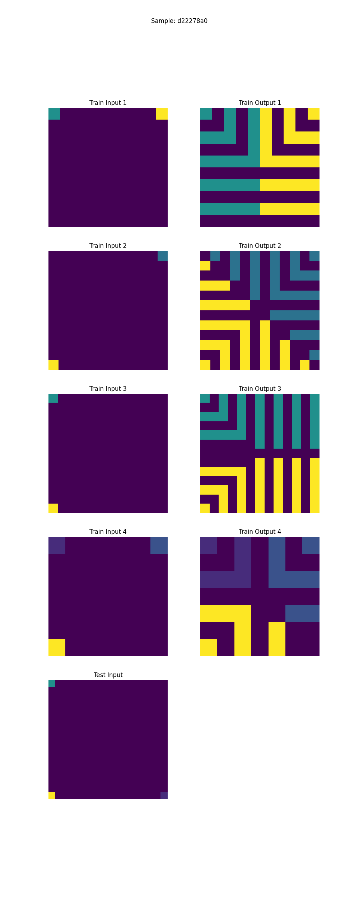
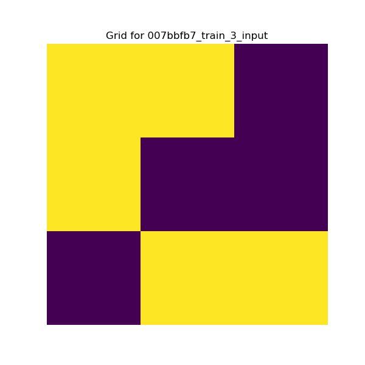

# shARC


# classes/data_transfomers 

This should contain a class containing how your data is transformed from the JSON file to the input for the model used.

# DataLoader Class

The `DataLoader` class is a utility for loading, processing, and handling datasets for challenges. It ensures that the datasets adhere to a specific structure. The class also provides functionalities to randomly sample data points and retrieve specific challenges by their ID.

## Usage

### Loading a dataset
The DataLoader class can load different types of datasets such as training, evaluation, and test. Here's how to load a dataset:
```
from classes.data_loader import DataLoader

# Initialize the DataLoader
dl = DataLoader()

# Load a dataset (e.g., 'training')
training_data = dl.load_dataset("training")

# Check the number of unique challenges
unique_keys = set(training_data.keys())
print(f"Number of training challenges: {len(unique_keys)}")
```

### Randomly Sampling Datapoints
You can randomly sample a specific number of data points from the loaded datasets:

```python
# Randomly sample 5 challenges from the loaded dataset
sampled_data = dl.randomly_sample_datapoints(5)

# Print out the sampled challenge IDs
for challenge_id in sampled_data.keys():
    print(f"Sampled Challenge ID: {challenge_id}")

```

### Retrieving a Specific Challenge
To retrieve a specific challenge by its ID:

```python
# Retrieve a specific challenge by ID
challenge_id = "007bbfb7"
challenge_data = dl.get_specific_sample(challenge_id)

# Access different parts of the challenge
print("Test Input:", challenge_data['test_input'])
print("Training Examples:", challenge_data['train_examples'])
print("Solution:", challenge_data['solution'])
```

### Plotting Data
The DataLoader class provides methods to visualize the data:

#### Plotting Train and Test Examples
```python
# Plot train and test examples for a specific challenge
dl.plot_train_and_test_examples({challenge_id: challenge_data})
```


```python
# Plot a specific solution grid
dl.plot_solution(challenge_data['test_input'], f"{challenge_id}_test_input")
```


### Finding similar solutions

Given an input grid, we can find similar solutions via:

```python

grid = [[...][...][...]]
similar_grids, original_idx = find_similar_solutions(grid, 5)

```

This function

1. Finds the N most similar grids from all solutions, using cosine similarity on the colour distribution, and grid size.
2. Augments the original solution via rotation, jittering, masking, scaling and cropping
3. Returns unique values within that pool, and add ensures solution is within that pool. 
# Puzzle Grid Augmentations

This project implements both **geometric** and **color augmentations** for puzzle grids. The goal is to generate new puzzle variations by applying these augmentations while preserving the puzzle's structure and meaning.

## Generating Augmentations

### Geometric Augmentations

Geometric augmentations include flipping and rotating the puzzle grid. The possible transformations are:

- **Vertical flip**: For any point (x, y), its vertically flipped counterpart is (x, -y).
- **Horizontal flip**: For any point (x, y), its horizontally flipped counterpart is (-x, y).
- **Rotation**: The grid can be rotated by 0°, 90°, 180°, or 270°:
    - **θ = 0** (No change): 
        - x' = x, y' = y
    - **θ = 90°**: 
        - x' = -y, y' = x
    - **θ = 180°**: 
        - x' = -x, y' = -y
    - **θ = 270°**: 
        - x' = y, y' = -x

This results in 16 total geometric augmentations, combining vertical flips, horizontal flips, and rotations:
- $`2`$ (vertical flip) × $`2`$ (horizontal flip) × $`4`$ (rotations) = 16.

However, certain combinations are redundant, which reduces the effective number of geometric augmentations to 8:
- Rotating 180° is equivalent to performing both a vertical and horizontal flip.
- Rotating 270° is the same as performing a 90° rotation followed by both a vertical and horizontal flip.
- Other combinations can similarly be simplified.

Thus, there are **8 unique geometric augmentations**.

### Colour Augmentations for Puzzle Grids

In addition to geometric transformations, **color augmentations** involve remapping the colors in the puzzle. These augmentations adhere to certain rules:

#### Key Concepts

- **Frozen Colors**: Two colors, grey and black, are treated as "frozen" because they do not convey significant information. These colors are mapped to the integers `0` and `1` and remain unchanged.
  
- **Non-Blank Puzzles**: All puzzles contain more than just grey and black (0 and 1). There are no puzzles that consist solely of 0s and 1s.

- **Information Preservation**: Each original color must be mapped to a unique new color. No two colors can be mapped to the same color (e.g., red and green cannot both be mapped to yellow), as this would result in a loss of information.

- **Combination of Colors**: To remap colors, we first select a subset of $`n`$ colors from a total set of 8 available colors (represented by integers from `1` to `8`). The number of ways to choose $`n`$ colors from 8 is determined by the **binomial coefficient** $`\binom{8}{n}`$ (read as "8 choose n").

- **One-to-One Mappings**: The color mappings must be **bijective**, meaning each color must be mapped to a unique color. The number of ways to assign $`n`$ colors to $`n`$ selected integers is $`n!`$ (i.e., `n` factorial), which accounts for all possible arrangements of the selected colors.

### Total Augmentations

The **total number of augmentations** for each number of colors is a product of the geometric augmentations and the color augmentations. The total formula is:

$`\text{Total augmentations} = \text{Geometric augmentations} \times (\binom{8}{n} \times n!)`$

Where $`\binom{8}{n}`$ represents the number of ways to choose $`n`$ colors from 8, and $`n!`$ accounts for the permutations of those selected colors.

### Maximum Number of Augmentations (1 to 8 Colors)

The table below summarizes the maximum number of possible augmentations for each number of colors (1 to 8), combining both geometric and color augmentations:

| Number of colours not black or grey (`n`) | Ways to Choose Colors ($`\binom{8}{n}`$) | Permutations ($`n!`$) | Color Augmentations ($`\binom{8}{n} \times n!`$) | Geometric Augmentations | Total Augmentations |
|------------------------|---------------------------------------|---------------------|-----------------------------------------------|-------------------------|---------------------|
| 1                      | $`\binom{8}{1} = 8`$                | $`1! = 1`$        | $`8 \times 1 = 8`$                         | 8                       | $`8 \times 8 = 64`$ |
| 2                      | $`\binom{8}{2} = 28`$               | $`2! = 2`$        | $`28 \times 2 = 56`$                       | 8                       | $`56 \times 8 = 448`$ |
| 3                      | $`\binom{8}{3} = 56`$               | $`3! = 6`$        | $`56 \times 6 = 336`$                      | 8                       | $`336 \times 8 = 2,688`$ |
| 4                      | $`\binom{8}{4} = 70`$               | $`4! = 24`$       | $`70 \times 24 = 1,680`$                   | 8                       | $`1,680 \times 8 = 13,440`$ |
| 5                      | $`\binom{8}{5} = 56`$               | $`5! = 120`$      | $`56 \times 120 = 6,720`$                  | 8                       | $`6,720 \times 8 = 53,760`$ |
| 6                      | $`\binom{8}{6} = 28`$               | $`6! = 720`$      | $`28 \times 720 = 20,160`$                 | 8                       | $`20,160 \times 8 = 161,280`$ |
| 7                      | $`\binom{8}{7} = 8`$                | $`7! = 5,040`$    | $`8 \times 5,040 = 40,320`$                | 8                       | $`40,320 \times 8 = 322,560`$ |
| 8                      | $`\binom{8}{8} = 1`$                | $`8! = 40,320`$   | $`1 \times 40,320 = 40,320`$               | 8                       | $`40,320 \times 8 = 322,560`$ |

### General Formula
The general formula for the total number of augmentations for $`n`$ colors is:

$`\text{Total augmentations} = 8 \times (\binom{8}{n} \times n!)`$

### Limits for dataset set

- Therefore, the **minimum number** of Augmented input/output training datapoints that can be generated from the training set is Number of Input Output Pairs in training set (1302) x 64 = 83,328.

- The **maximum number** is Number of Input Output Pairs in training set (1302) x 322,560 = 432,993,120. 

- Due to the frequency of non-black or grey colours used, total augmentations is likely to be nearer to the minimum as rarely do puzzles utilize non-black or grey colours.

- There are on average 3.225 datapoints per training example (1302/400).
